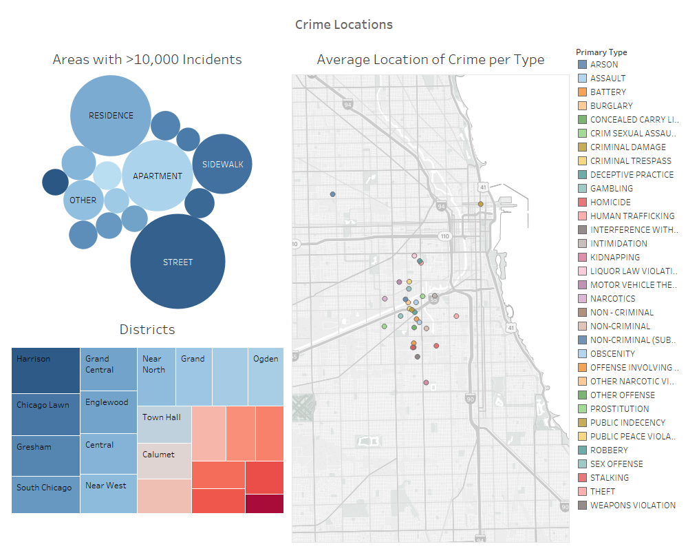
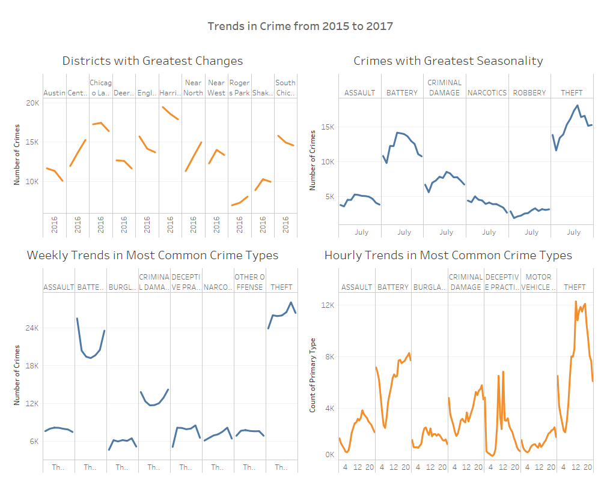

# Chicago-Crime-Analysis
Data analysis project to discover insights and trends of crime in Chicago - (2018)

### About
This was a project I did while in the Business Data Analysis (BUS443) course. The purpose of this data analysis project was to take the skills I had learned during lecture and apply them to a real world problem - crime in Chicago and how to best address the issue. The data used in this project was downloaded from the [City of Chicago Crime Catalog](https://www.chicago.gov/city/en/dataset/crime.html), and contained over 800,000 distinct incidents over 17 years, from 2000 to 2017.

### Process
This project was broken down into 4 discrete steps:
1. Cleaning, reorganizing, and fixing errors in the data using MS Excel, MS Access, and SQL
2. Importing the data (only 2015-2017 due to lack of processing power) into Tableau
3. Creating and interpretting visualizations to understand trends in crime such as: seasonality, overall changes, and patterns
4. Recommending a course of action based on insights gained from the visualization to the Chicago PD (This didn't actually happen, it was a mock presentation to the class)
  

### Visualizations (Tableau Dashboards that are interactive, so some data is cut off)
#### Chicago Crime Overview 2015-2017

**Total Crime** → We can see that the overall crime trend is increasing during the time period of 2015-2017. Even though crime is down in 2017, we need to look at more years to get a clearer picture of the situation.

**Crimes Exceeding the Monthly Average** → The average crime count per month over the 3 year period was calculated, and any crime with a monthly average higher than the overall is considered a *common crime*. Homicide is one of the crimes that exceeds this monthly average. Yay Chicago! (Sarcasm)

**Districts Exceeding the Monthly Average** → Likewise, this same analysis was conducted with the districts of Chicago to discover which districts should be considered more dangerous.

**Where Crimes Exceeding the Monthly Average are Most Likely to Occur** → I took the crimes that exceeded the monthly average and overlaid their average GPS coordinates on a map of Chicago, also overlaid with colors representing mean household income. Right off the bat, we can see that these *common crimes* usually occur in areas that are well below the income of the wealthiest areas of the city, but also surprisingly don't occur in the poorest areas of the city. With this visualization, you can see that these crimes *usually* occur in different areas than others, begging the question: Why? What is different about one district of Chicago that leads to (for example) more narcotics arrests than others? Is there some different type of policing (or just more of it) in this specific area to address this type of crime. 
  

#### Chicago Crime Locations 2015-2017

**Areas with 10k+ Incidents** → Here we can see the most likely place for a crime to take place within the City of Chicago. It is important to note that this data represents an arrest, not necessarily a crime. While most people arrested are done so during the process of committing a crime or shortly after, it is important to be aware of this bias. After all, if you are actively committing a crime, or are wanted for a crime, the Chicago PD will most likely arrest you in a public area, like a *street* or *sidewalk*. Occasionally inside an accomodation too; How often do the police get warrants in this city?

**Districts with 10k+ Incidents** → This is self explainatory, we can see the names of the districts with the most crime. (given over 10k incidents per month)

**Average Location of Crime per Type** → Similar to the visualization in the first dashboard above, we can see the average location (via GPS) of each type of crime. This includes all crimes, not just the ones exceeding the monthly average. The first, most obvious insight here is that we can clearly see the most dangerous area of Chicago quite clearly. But also we can ask, *What is pulling the average location of **Public Indecency** to the Near North Side area?* We need to dig into the data a little more, especially since rates of Public Indecency exceed the monthly average! (see first visualization)
  

#### Chicago Crime Trends 2015-2017

**This isn't the most beautiful dashboard due to lack of space, but it provides a lot of valuable insight into crime trends.**

**Districts with Greatest Changes** → This, I think, is the most valuable graph regarding districts in Chicago and their crime rates. While it only includes those with the greatest changes (only 11), we get some valuable insights. A lot of typically dangerous districts are actually experiencing a decrease in crime, overall. Great! But, we might need to take a look at what is happening in the districts of *Central* and *Near North*.  While both these districts do not exceed the month average yet (see first visualization), they have experienced a steep increase from 2015 to 2016, and again to 2017, despite the fact that overall crime levels are down in 2017 from a high in 2016.

**Crimes with Greatest Seasonality** → Here we can see 6 crimes that have the greatest seasonality, or variation over the course of the year. A notable trend in *Theft*, *Criminal Damage*, and *Battery* is the significant increase during the summer time. Does this happen because more people are more active as it gets warmer in the City? Additionally, it is interesting that there is a drop in these crimes early in the year, around February or March. *Why is that?* Is it the cold and snow of winter or something else? Additionally analysis comparing crime rates, daily temperature, and snowfall is required for me to prove this hypothesis.

**Weekly Trends in Most Common Crime Types** → This is another intersting graph, in that we can see how the occurrance of the most common crime types varies over the course of the week. It seems that most of these crimes follow a general pattern of increaing over during the weekdays, but falling during the weekends. This makes sense for some crimes, such as *Burglary*, as you would expect homeowners to be at work their their residences empty. Others such as *Battery* and *Criminal Damages* follow the opposite trend: falling sharply during the week, but increasing on the weekend. Could this be a result Alcohol intake on the weekends leading to reckless actions? More analysis is required to find out.

**Hourly Trends in Most Common Crime Types** → Another very interesting graphic which can help us understand what police should be looking for during their shift. Now, it is also important to note that this data, again, represents arrests, which could or could not occur as the crime is taking place; potentially an hour or 6 afterwards, leading to some bluriness in our data. Overall, however, we can see that the early morning hours are the least active for criminals in Chicago, and their activity generally increases as the day goes on. Falling into this trend is *Burglary*, meaning Chicagoans can be confident that someone will *most likely not* break into their residence while they are sleeping; but rather when they are away at work.
  

### What I Learned

**Data Analysis Tools** → MS Excel, MS Access, SQL\
**Data Visualization Tools** → Tableau\
**Soft Skills and Critical Thinking** → Public Speaking, Interpreting Visualizations & Data
