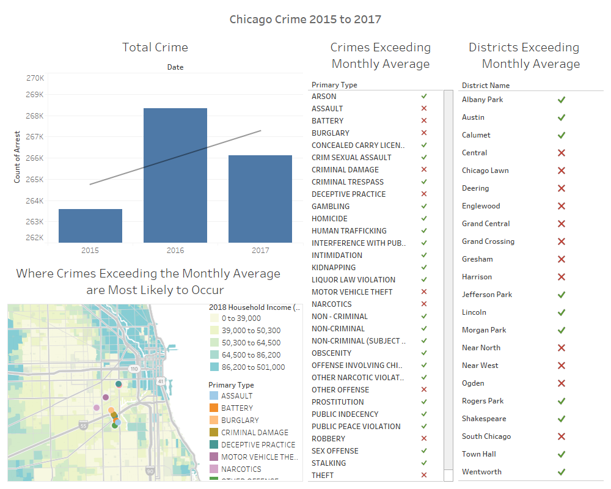

# Chicago-Crime-Analysis
Data analysis project to discover insights and trends of crime in Chicago - (2018)

### About
This was a project I did while in the Business Data Analysis (BUS443) course. The purpose of this data analysis project was to take the skills I had learned during lecture and apply them to a real world problem - crime in Chicago and how to best address the issue. The data used in this project was downloaded from the [City of Chicago Crime Catalog](https://www.chicago.gov/city/en/dataset/crime.html), and contained over 800,000 distinct incidents over 17 years, from 2000 to 2017.

### Process
This project was broken down into 4 discrete steps:\
1. Cleaning, reorganizing, and fixing errors in the data using MS Excel, MS Access, and SQL
2. Importing the data (only 2015-2017 due to lack of processing power) into Tableau
3. Creating and interpretting visualizations to understand trends in crime such as: seasonality, overall changes, and patterns
4. Recommending a course of action based on insights gained from the visualization to the Chicago PD (This didn't actually happen, it was a mock presentation to the class)

### Visualizations
#### Chicago Crime Overview 2015-2017

**Total Crime**
**Where Crimes Exceeding the Monthly Average are Most Likely to Occur**
**Crimes Exceeding the Monthly Average**
**Districts Exceeding the Monthly Average**

Fixed errors and discrepancies in over 798,000 rows of Chicago crime data from 2000 to 2017 using Microsoft Excel and Access
Analyzed data 3 years of data with Tableau by reorganizing, graphing, and visualizing to develop insights
Discovered trends in crime data such as: seasonality, overall decreases and increases, and weekly and hourly patterns
Created visuals to show easily communicate trends, counts, and maps of crime data
Recommended a course of action based on the insights developed from analyzing the crime data
